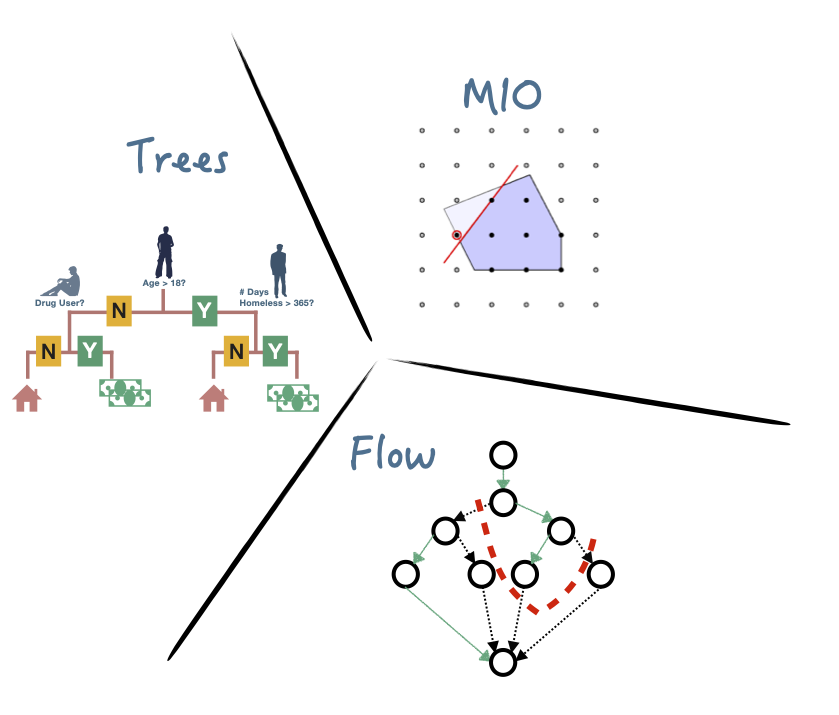

# Strong Optimal Classification Trees

Code for the paper ''[Strong Optimal Classification Trees](https://sites.google.com/view/sina-aghaei/home)''.

The code will run in python3 ( version 6 and higher) and require [Gurobi9.x](https://www.gurobi.com/downloads/gurobi-optimizer-eula/) solver. The required packages are listed in `requirements.txt`.

***

## Overview

The content of this repository is as follows:

- `Code` contains the implementation of approaches **FlowOCT** and **BendersOCT**. For each approach blah blah.

- `Results` contains the experiments raw results.

- `plots` contains the R script for generating figures and tables from the tabular results.
